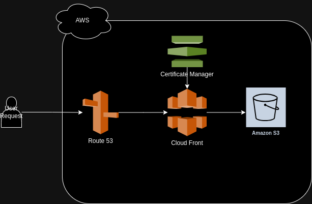

# S3 Static Website Project

Read me guide for the **Static Website Project** task given by **Saqib Akhtar (Top G)** to **Majid Khan Burki**.

## Table of Contents

- [S3 Static Website Project](#s3-static-website-project)
  - [Table of Contents](#table-of-contents)
  - [Description](#description)
  - [Architecture](#architecture)
  - [Requirements](#requirements)
  - [Providers](#providers)
  - [Modules](#modules)
  - [Resources](#resources)
  - [Inputs](#inputs)
  - [Outputs](#outputs)

## Description

General description of what the Terraform scripts do.

A static website will be created and contents of the */build* folder will be uploaded to an **S3** bucket called `xldp.xgrid.co`. The contents inside this bucket have been generated using the `create-react-app` library. At this moment, website is very basic as it only displays a single `index.html` page. 

Through AWS **Route 53** a custom domain name will be assigned to this bucket (instead of the generated S3 endpoint). Domain name is: `xldp.xgrid.co`.

For the sake of security, a certificate will also be generated through the **AWS Certificate Manager (ACM)** to enable security for this static website. The records for this certificate will also be added to **Route 53**.

In the end, a **Cloud Front Distribution** will also be created, the SSL certificate will be associated with this distribution and this distribution will host the website/ speed up its delivery.

## Architecture

The project makes use of Amazon S3 to store the contents of the website that has been generated with `create-react-app`. At this moment, it's very basic in nature. AWS Route 53 is used to assign a custom domain/URL to the website through which it is accessed.

Once the user makes a query to the website (enters URL), Route 53 accesses it and forward it to Cloud Front which has a certificate for SSL enabled via AWS Certificate Manager. The Cloud Front gets it's content from the S3 bucket.

## Requirements

No requirements.

## Providers

| Name | Version |
|------|---------|
|  [aws](#provider\_aws) | 5.36.0 |
|  [null](#provider\_null) | 3.2.2 |

## Modules

No modules.

## Resources

| Name | Type |
|------|------|
| [aws_acm_certificate.xldp_xgrid_co](https://registry.terraform.io/providers/hashicorp/aws/latest/docs/resources/acm_certificate) | resource |
| [aws_cloudfront_distribution.xldp_xgrid_co](https://registry.terraform.io/providers/hashicorp/aws/latest/docs/resources/cloudfront_distribution) | resource |
| [aws_cloudfront_origin_access_identity.xldp_oai](https://registry.terraform.io/providers/hashicorp/aws/latest/docs/resources/cloudfront_origin_access_identity) | resource |
| [aws_route53_record.acm_validation](https://registry.terraform.io/providers/hashicorp/aws/latest/docs/resources/route53_record) | resource |
| [aws_route53_record.cloudfront_xldp_xgrid_co](https://registry.terraform.io/providers/hashicorp/aws/latest/docs/resources/route53_record) | resource |
| [aws_route53_record.xldp_xgrid_co](https://registry.terraform.io/providers/hashicorp/aws/latest/docs/resources/route53_record) | resource |
| [aws_s3_bucket.xldp_xgrid_co](https://registry.terraform.io/providers/hashicorp/aws/latest/docs/resources/s3_bucket) | resource |
| [aws_s3_bucket_policy.cloudfront_bucket_policy](https://registry.terraform.io/providers/hashicorp/aws/latest/docs/resources/s3_bucket_policy) | resource |
| [null_resource.sync_build_folder](https://registry.terraform.io/providers/hashicorp/null/latest/docs/resources/resource) | resource |
| [aws_iam_policy_document.cloudfront_bucket_policy](https://registry.terraform.io/providers/hashicorp/aws/latest/docs/data-sources/iam_policy_document) | data source |

## Inputs

| Name | Description | Type | Default | Required |
|------|-------------|------|---------|:--------:|
|  [aws\_region](#input\_aws\_region) | The AWS region in which resources will be created. | `string` | `"us-east-1"` | no |
|  [bucket\_name](#input\_bucket\_name) | The name of the S3 bucket to be created. | `string` | `"xldp.xgrid.co"` | no |
|  [build\_folder\_path](#input\_build\_folder\_path) | Path to the build folder to sync with the S3 bucket. | `string` | `"build/"` | no |
|  [cloudfront\_oai\_comment](#input\_cloudfront\_oai\_comment) | Comment for the CloudFront Origin Access Identity. | `string` | `"xldp.xgrid.co OAI"` | no |
|  [domain\_name](#input\_domain\_name) | The domain name for the ACM certificate and Route 53 records. | `string` | `"xldp.xgrid.co"` | no |
|  [zone\_id](#input\_zone\_id) | The Zone ID for the Route 53 DNS records. | `string` | `"Z04915193OVBRMG8HX327"` | no |

## Outputs

No outputs.
